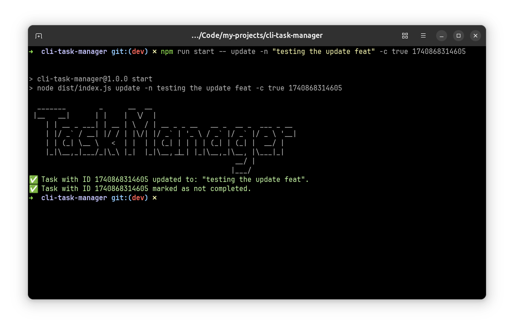

# CLI Task Manager


A simple CLI-based task manager built using Node.js and Commander.js. It allows users to add, update, remove, and track tasks using a JSON file.

## Installation

```sh
npm install
npm run build
```

**NOTE**: Once you run the build command a dist file will be cerated and within that will will find a "tasks.json" file which will have all your tasks

## Usage

```sh
    npm run start
```


### Add a Task

```sh
npm run start add "Your Task Here"
```


### Update a Task

```sh
npm run start -- update -n "testing the update feat" -c true 1740868314605
```



### Remove a Task

```sh
npm run start remove <task_id>
```


### ⚠️ If no task Found


### List All Tasks

```sh
npm run start list
```


### Check Status

```sh
npm run start list --status false
```


## Features

- Add tasks
- Update tasks (name & completion status)
- Remove tasks
- List all tasks

## File Storage

All tasks are stored in a JSON file located at `tasks.json`.

## Contributing

Feel free to contribute by opening issues or submitting pull requests!

## License

MIT
