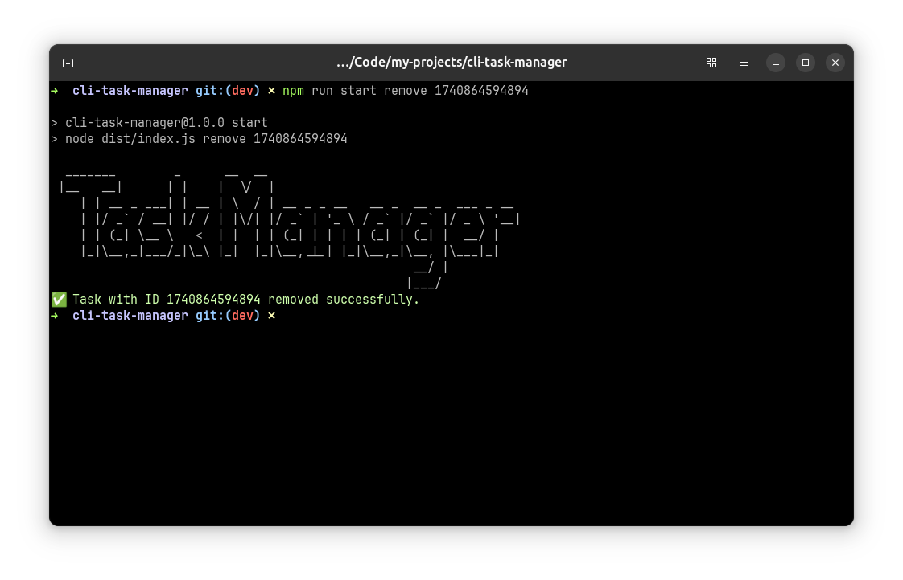

# CLI Task Manager

A simple CLI-based task manager built using Node.js and Commander.js. It allows users to add, update, remove, and track tasks using a JSON file.

## Installation

```sh
npm install
npm run build
```

**NOTE**: Once you run the build command a dist file will be cerated and within that will will find a "tasks.json" file which will have all your tasks

## Usage

### Add a Task

```sh
node dist/index.js add "Your Task Here"
```


### Update a Task

```sh
node dist/index.js update -n "testing the update feat" -c true 1740861440788
```


### Remove a Task

```sh
node dist/index.js remove <task_id>
```



### ⚠️ If no task Found


### List All Tasks

```sh
node dist/index.js list
```


## Features

- Add tasks
- Update tasks (name & completion status)
- Remove tasks
- List all tasks

## File Storage

All tasks are stored in a JSON file located at `tasks.json`.

## Contributing

Feel free to contribute by opening issues or submitting pull requests!

## License

MIT
